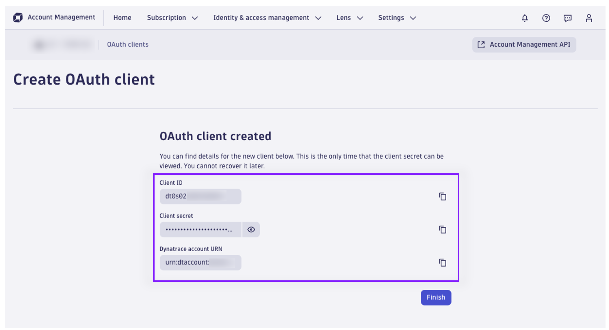
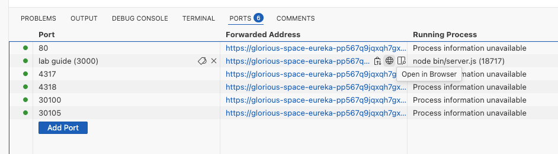
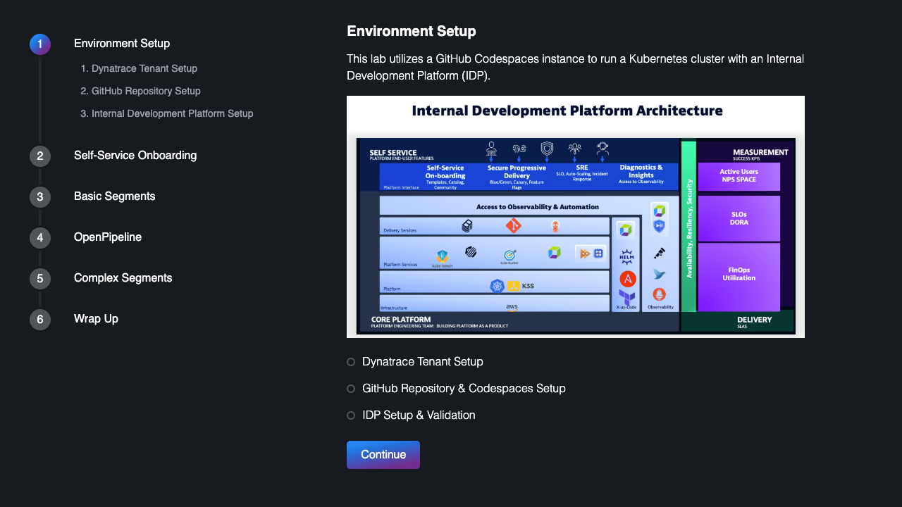

id: enablement-openpipeline-segments-iam

summary: dynatrace openpipeline segments and iam policies

author: Tony Pope-Cruz

# Enablement OpenPipeline, Segments, and IAM Policies

During this hands-on training, we’ll deploy an internal development platform (IDP) on Kubernetes and observe it with Dynatrace. To introduce the paradigm shift from classic Management Zones to data permissions and filtering on Grail, we’ll configure OpenPipeline, Segments, and IAM Policies to provide role-based access and analysis controls.

## Dynatrace Tenant Setup

You will need a Dynatrace SaaS tenant.

### Identify Dynatrace SaaS Tenant

Make a note of the Dynatrace environment name. This is the first part of the URL. `abc12345` would be the environment ID for `https://abc12345.apps.dynatrace.com`

* For those running in other environments (such as `sprint`), make a note of your environment: `dev`, `sprint` or `live`

### Skip DT OAuth Client (optional)

> ⚠️ Stop! If you are unable to create an OAuth Client, you can still complete this lab with partial functionality ⚠️

Use the following fake values for your OAuth Client:

Client id: 
```text
dt0f02.ABC123
```

Client secret:
```text
dt0f02.ABC123.J5TVHCR6MJ4AAO4PX3MFGUKX4E42QJ4MUAM65DGC7ZKOHBK7DKY23WQPBKO
```

Account URN:
```text
urn:dtaccount:e64e7279-f0b0-43e0-aedb-9eb3fa8c5cac
```

### Create DT OAuth Client

Open the Dynatrace Account Management page.  Click on `Identity & access management`.  Click on `OAuth clients`.


Create a new OAuth Client by clicking on `Create client`.

Provide your account email address and name the client `segments-client`.

Configure the client to have the following permissions:

> - `document:documents:write`
> - `document:documents:read`
> - `automation:workflows:read`
> - `automation:workflows:write`
> - `storage:logs:read`
> - `storage:events:read`
> - `storage:events:write`
> - `storage:metrics:read`
> - `storage:bizevents:read`
> - `storage:bizevents:write`
> - `storage:system:read`
> - `storage:buckets:read`
> - `storage:spans:read`
> - `storage:entities:read`
> - `storage:fieldsets:read`

Note: Your user account must have these permissions.  Follow [the documentation](https://www.dynatrace.com/support/help/platform-modules/business-analytics/ba-api-ingest) to set up an OAuth client + policy + bind to your service user account email.



After the client is created, copy and save the client details.  Once you click `Finish`, you can never obtain the `client secret` ever again!!

You should now have 5 pieces of information:

1. A DT environment (`dev`, `sprint` or `live`)
1. A DT environment ID
1. An OAuth client ID
1. An OAuth client secret
1. An account URN

### Create DT API Token

Create a Dynatrace access token with the following permissions. This token will be used by the setup script to automatically create all other required DT tokens.

1. `apiTokens.read`
1. `apiTokens.write`


You should now have 6 pieces of information:

1. A DT environment (`dev`, `sprint` or `live`)
1. A DT environment ID
1. An oAuth client ID
1. An oAuth client secret
1. An account URN
1. An API token

## GitHub Repository Setup

You will need a GitHub account.

The source repository for this lab is: 

[enablement-openpipeline-segments-iam](https://github.com/dynatrace-wwse/enablement-openpipeline-segments-iam)

The reference repository (*not* used for this lab) is:

[platform-engineering-demo](https://github.com/dynatrace-perfclinics/platform-engineering-demo)

### Fork Repository

Create your own fork of the source repository.

> ⚠️ Note ⚠️ running this lab will modify the repository, you will need to delete your fork and start from the beginning (new fork) every time you run this lab!


### ⚠️ Enable Actions in your Fork ⚠️

> ⚠️ This step is important! ⚠️

This lab uses one GitHub action to automatically merge Pull Requests when apps are onboarded.

In your fork, go to `Actions` and click the green button: `I understand my workflows, go ahead and enable them`.


### Configure Codespaces Settings

By default, codespaces instances will suspend after 30 minutes of inactivity.  This may cause problems with your lab.

Open GitHub Account settings at [https://github.com/settings/profile](https://github.com/settings/profile)


Increase the `Default idle timeout` setting.

### Create Codespaces Instance

In your fork:

1. Switch to the `main` branch
1. Click the green `Code` button
1. Change to `Codespaces`
1. Click the `...` and choose `New with options...`


**Warning!** Do not click the green "Create codespace on codespace" button!!

Fill in the form and launch the codespace.


Be sure to select 4-core as your machine type.

Choose a region close to your Dynatrace tenant.  If you run into issues with spinning up your codespaces instance, try selecting a different region.


If you have **already** defined the environment variables in your repository, you'll see a screen asking you to associate those secrets with this repository. Please check the boxes as shown below.


The codespaces instance will launch and the setup scripts will execute.

Wait until the `Running postStartCommand...` disappears. It should take ~10 minutes.

If the launch was successful, you should be able to run the following command without errors:

```text
kubectl get ns
```

> ⚠️ Note ⚠️ If you encounter an error and the launch was unsuccessful, try running the instance in a different Github cloud region/location.  You will need to delete your *fork* and start over from the beginning.  Do not continue with the same fork or codespaces instance!

### Activate Kubernetes Experience in Dynatrace

When the codespaces instance is finished launching, go to the Terminal prompt and run the following command:

```text
kubectl get pods -n dynatrace
```


Run this command every couple minutes until you see the `platform-engineering-demo-activegate-0` pod running and ready.

Navigate to the Dynatrace tenant and launch the `Kubernetes` App.  You should eventually see a cluster pending activation.  Activate the Kubernetes Experience for your `platform-engineering-demo` cluster.


## Launching Lab Guide

Move into the lab-guide directory

Command:
```sh
cd lab-guide
```

Generate the lab guide content

Command:
```sh
node bin/generator.js
```

Launch the lab guide as a Node.js server

Command:
```sh
nohup node bin/server.js > /dev/null 2>&1 &
```

Move back into the base directory

Command:
```sh
cd /workspaces/enablement-openpipeline-segments-iam
```

Open the lab guide in your browser from the Codespaces instance exposed ports





Use the lab guide to move through the hands on exercises.
