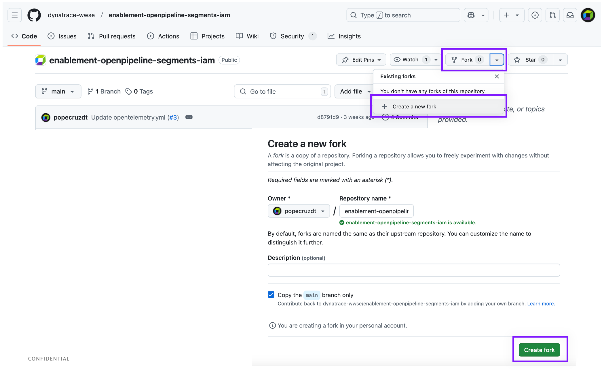
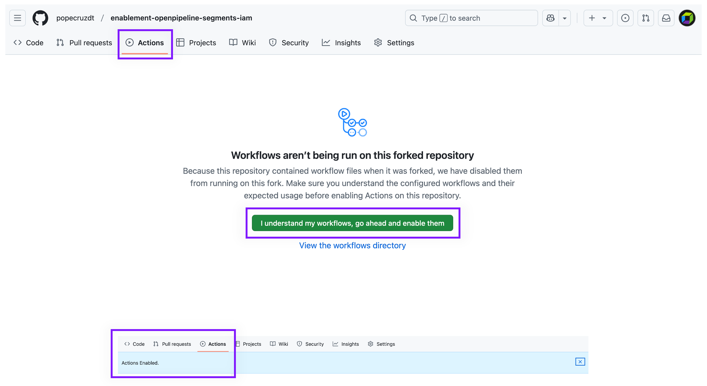
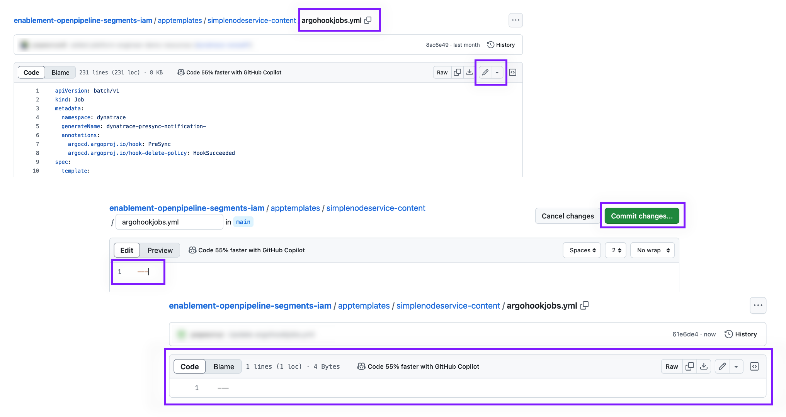
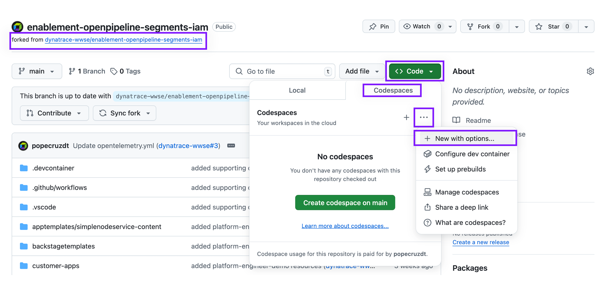
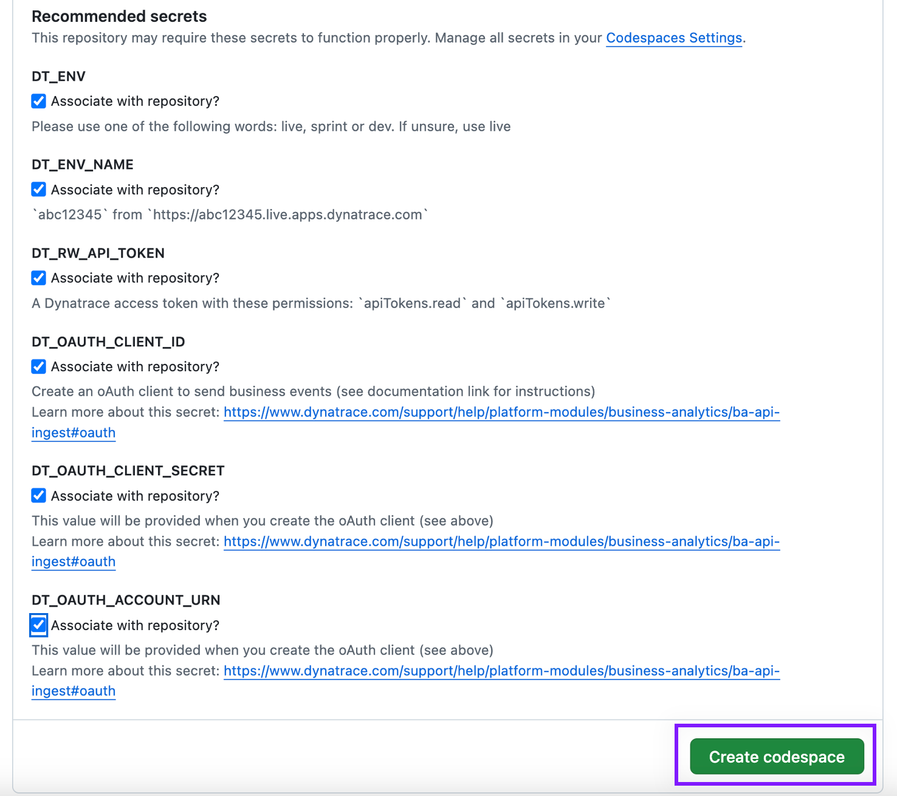
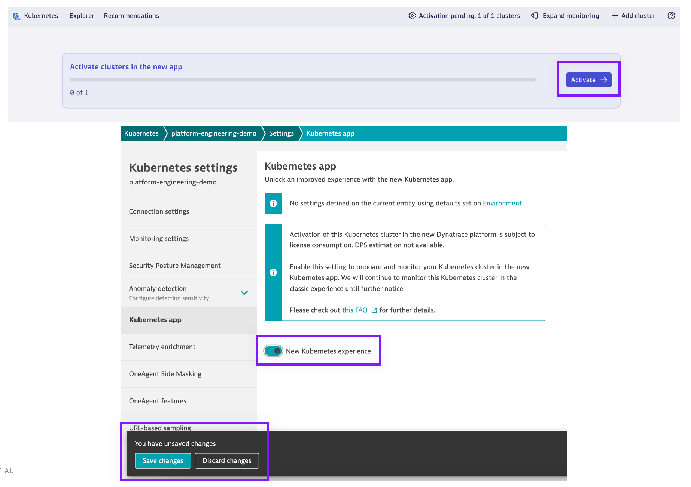

## GitHub Repository Setup

You will need a GitHub account.

The source repository for this lab is: 

[enablement-openpipeline-segments-iam](https://github.com/dynatrace-wwse/enablement-openpipeline-segments-iam)

The reference repository (*not* used for this lab) is:

[platform-engineering-demo](https://github.com/dynatrace-perfclinics/platform-engineering-demo)

### Fork Repository

Create your own fork of the source repository.

> ⚠️ Note ⚠️ running this lab will modify the repository, you will need to delete your fork and start from the beginning (new fork) every time you run this lab!



### ⚠️ Enable Actions in your Fork ⚠️

> ⚠️ This step is important! ⚠️

This lab uses one GitHub action to automatically merge Pull Requests when apps are onboarded.

In your fork, go to `Actions` and click the green button: `I understand my workflows, go ahead and enable them`.



### Delete ArgoCD Hook Jobs (optional)

If you do not have an OAuth Client, you will not be able to execute ArgoCD Hook Jobs that generate BizEvent data.



In your fork, go to `Code`.  Navigate to `/apptemplates/simplenodeservice-content/argohookjobs.yml`.

Edit the file, delete all contents, and replace with `---`.  Save the file.

### Configure Codespaces Settings

By default, codespaces instances will suspend after 30 minutes of inactivity.  This may cause problems with your lab.

Open GitHub Account settings at [https://github.com/settings/profile](https://github.com/settings/profile)


Increase the `Default idle timeout` setting.

### Create Codespaces Instance

In your fork:

1. Switch to the `main` branch
1. Click the green `Code` button
1. Change to `Codespaces`
1. Click the `...` and choose `New with options...`



**Warning!** Do not click the green "Create codespace on codespace" button!!

Fill in the form and launch the codespace.


Be sure to select 4-core as your machine type.

Choose a region close to your Dynatrace tenant.  If you run into issues with spinning up your codespaces instance, try selecting a different region.


If you have **already** defined the environment variables in your repository, you'll see a screen asking you to associate those secrets with this repository. Please check the boxes as shown below.



The codespaces instance will launch and the setup scripts will execute.

Wait until the `Running postStartCommand...` disappears. It should take ~10 minutes.

If the launch was successful, you should be able to run the following command without errors:

```text
kubectl get ns
```

> ⚠️ Note ⚠️ If you encounter an error and the launch was unsuccessful, try running the instance in a different Github cloud region/location.  You will need to delete your *fork* and start over from the beginning.  Do not continue with the same fork or codespaces instance!

### Activate Kubernetes Experience in Dynatrace

When the codespaces instance is finished launching, go to the Terminal prompt and run the following command:

```text
kubectl get pods -n dynatrace
```


Run this command every couple minutes until you see the `platform-engineering-demo-activegate-0` pod running and ready.

Navigate to the Dynatrace tenant and launch the `Kubernetes` App.  You should eventually see a cluster pending activation.  Activate the Kubernetes Experience for your `platform-engineering-demo` cluster.


