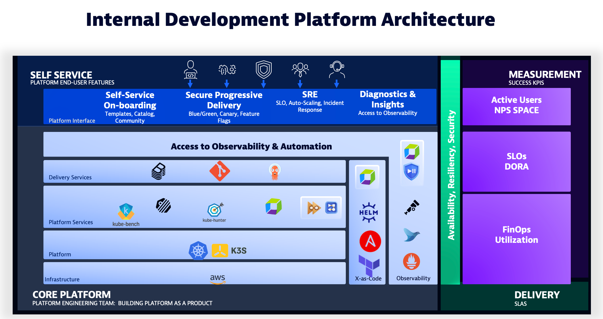

## Environment Setup

This lab utilizes a GitHub Codespaces instance to run a Kubernetes cluster with an Internal Development Platform (IDP).

* Dynatrace Tenant Setup
* GitHub Repository & Codespaces Setup
* IDP Setup & Validation