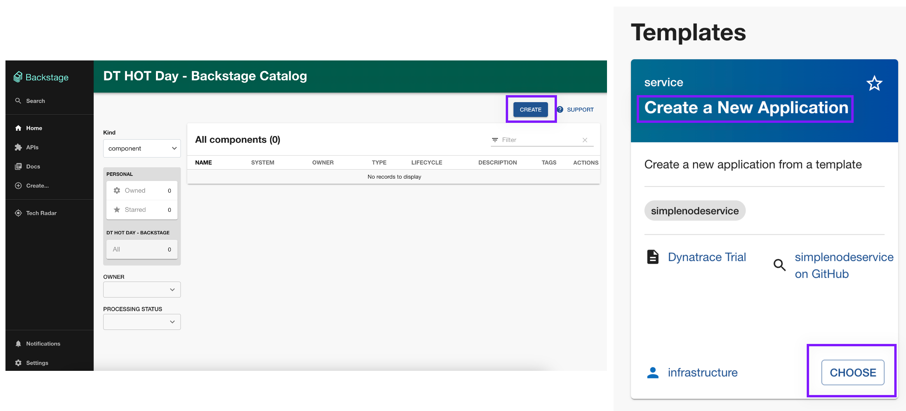
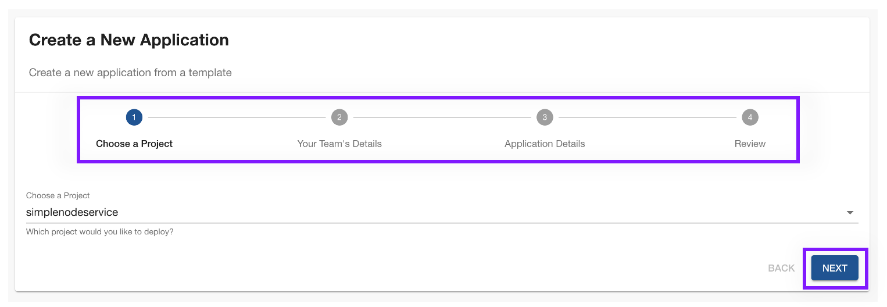
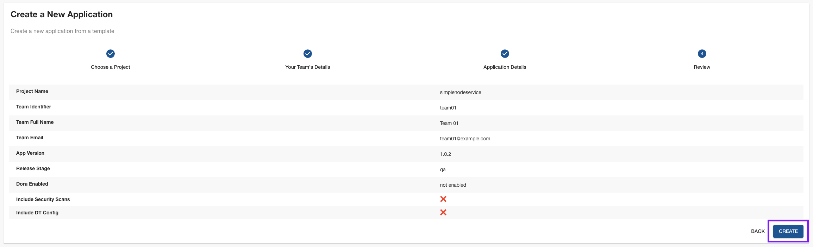
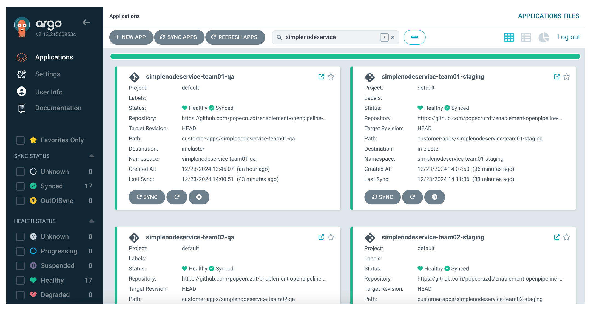

## Onboard New Apps

Use Backstage to create (4) new applications on the internal development platform (IDP).

### Create New Component

Navigate to Backstage (using port 30105 of your codespaces instance).  

Click on `Create` near the top right corner of the page.

From the Templates, locate `Create a New Application` and click on `Choose`.

Follow the 4 step template to create a new application using these values:

| Field                   | Value                       |
|-------------------------|-----------------------------|
| Project Name            | SimpleNodeService           |
| Team Identifier         | team01                      |
| Team Full Name          | Team 01                     |
| Team Email              | team01@dynatrace.training   |
| App Version             | 1.0.2                       |
| Release Stage           | qa                          |
| DORA Enabled            | enabled                     |
| Include Security Scans  | enabled                     |
| Include DT Config       | enabled                     |

Review the new application details and click `Create`.

Wait for the merge request to be merged automatically (1-2 minutes) and for ArgoCD to finish deploying the new app (3-5 minutes).

### Create Additional Components

Repeat the previous steps, 3 more times, to onboard a total of (4) applications.  Use the following values:

> ⚠️ Deploying multiple components at the same time may cause issues due to resource constraints.  Deploy one component at a time and wait for it to be fully deployed before adding more. ⚠️

| Field                   | Value                       | Value 2                    | Value 3                    | Value 4                    |
|-------------------------|-----------------------------|----------------------------|----------------------------|----------------------------|
| Project Name            | SimpleNodeService           | SimpleNodeService          | SimpleNodeService          | SimpleNodeService          |
| Team Identifier         | team01                      | team01                     | team02                     | team02                     |
| Team Full Name          | Team 01                     | Team 01                    | Team 02                    | Team 02                    |
| Team Email              | team01@dynatrace.training   | team01@dynatrace.training  | team02@dynatrace.training  | team02@dynatrace.training  |
| App Version             | 1.0.2                       | 1.0.2                      | 1.0.2                      | 1.0.2                      |
| Release Stage           | qa                          | staging                    | qa                         | staging                    |
| DORA Enabled            | enabled                     | enabled                    | enabled                    | enabled                    |
| Include Security Scans  | enabled                     | enabled                    | enabled                    | enabled                    |
| Include DT Config       | enabled                     | enabled                    | enabled                    | enabled                    |

### Review New Components

In your Backstage catalog, you should now have (4) components for the (4) new applications.

### Validate App Deployment

Navigate to the ArgoCD instance (using port 30100 of your codespaces instance).

ArgoCD will automatically deploy the new applications based on the manifests created in the Git repository by Backstage.

ArgoCD will reconcile the configurations every 3 minutes.  When a change is detected, it will automatically sync and deploy the changes to the Kubernetes cluster.  This process may take 5-10 minutes total for all (4) applications to be deployed successfully.

Wait for the apps to be deployed and for all (4) apps to show as `Healthy` and `Synced`.  In case of any issues with the sync, sync the app manually to try again.
