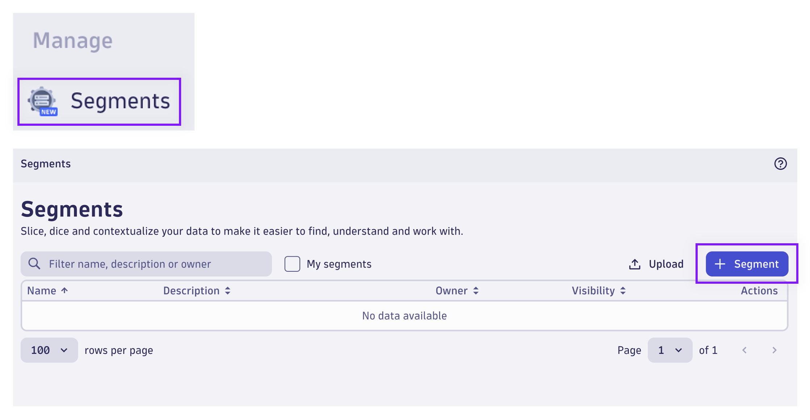
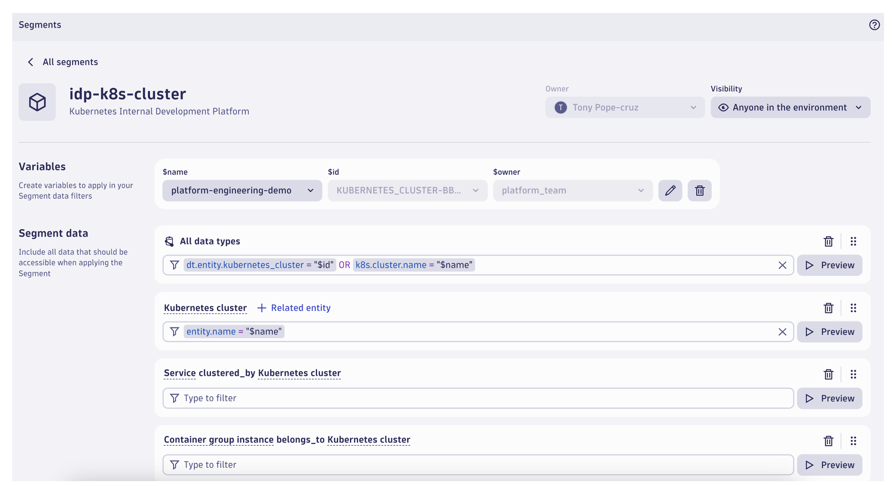
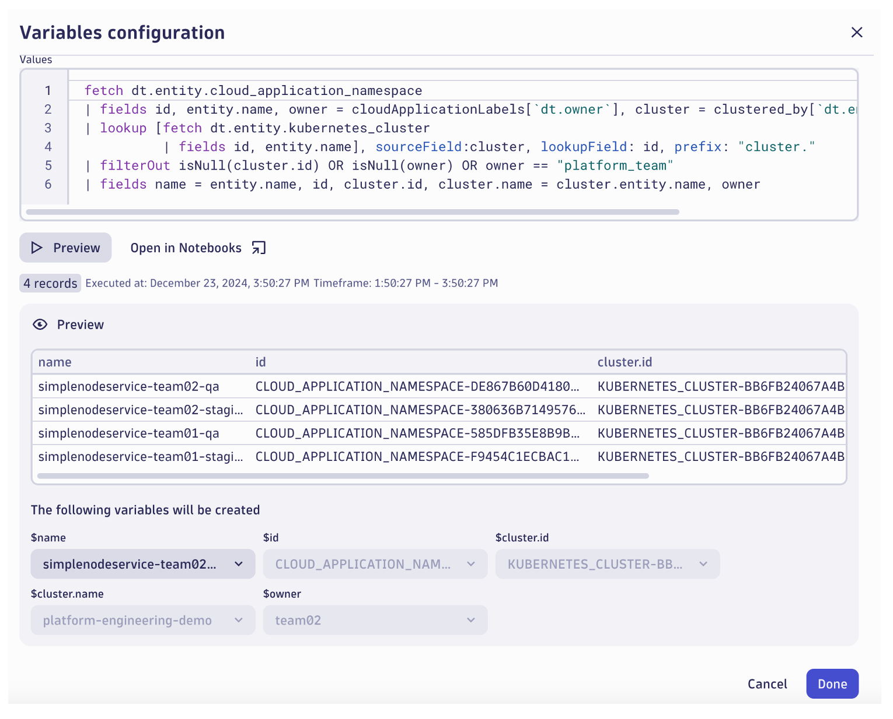

## Create Kubernetes Segments

Create Segments to filter analysis on Kubernetes properties, Cluster and Namespace

### Segment: Kubernetes Cluster (IDP)

In the Dynatrace environment, locate and launch the `Segments` App.



Click on `+ Segment` to create a new Segment.



Name the Segment `idp-k8s-cluster`.

Begin by defining a Variable for the Segment.


In your Variables configuration, enter the following DQL Query:

```sql
fetch dt.entity.kubernetes_cluster
| fields name = entity.name, id, namespace = cluster_of[`dt.entity.cloud_application_namespace`]
| expand namespace
| lookup [fetch dt.entity.cloud_application_namespace
          | filter in(entity.name,{"argocd","backstage"})
          | fields id, entity.name, cloudApplicationLabels
          | fieldsFlatten cloudApplicationLabels
          | fields id, name = entity.name, owner = `cloudApplicationLabels.dt.owner`
          | filter owner == "platform_team"], sourceField: namespace, lookupField: id, prefix: "namespace."
| filterOut isNull(namespace.id)
| summarize collectDistinct(id), by: {name, id, namespace.owner}
| fields name, id, owner = namespace.owner
```

Click `Preview` to run the query.  You should see your `platform-engineering-demo` cluster details.

Click `Done`.


Under Segment data, create a new rule for `All data types`.  Type to add a filter.  Use the following filter:

```text
dt.entity.kubernetes_cluster = "$id" OR k8s.cluster.name = "$name"
```

Adding this segment data filter to our Segment will apply to any Grail data queries when this Segment is applied.

Under Segment data, create a new rule for `Entities` > `Kubernetes cluster`.  Type to add a filter.  Use the following filter:

```text
entity.name = "$name"
```

Add related Kubernetes entities to the Segment data filter.  Click on `+ Related entity` and choose `Kubernetes namespace`.  This will include any Kubernetes namespace entity that is related to the Kubernetes cluster.  Repeat this process for ALL related entity types.

As you make your configurations, clicking on `Preview` will allow you to see which entities or data types matched your filter.

When your Segment configuration is complete, click on `Save`.

Note: You can change the visibility of your Segment, however if you are the only one accessing the environment, this is irrelevant.

### Segment: Kubernetes Namespace (IDP)

Click on `+ Segment` to create a new Segment.


Name the Segment `idp-k8s-namespace`.

Begin by defining a Variable for the Segment.



In your Variables configuration, enter the following DQL Query:

```sql
fetch dt.entity.cloud_application_namespace
| fields id, entity.name, owner = cloudApplicationLabels[`dt.owner`], cluster = clustered_by[`dt.entity.kubernetes_cluster`]
| lookup [fetch dt.entity.kubernetes_cluster
          | fields id, entity.name], sourceField:cluster, lookupField: id, prefix: "cluster."
| filterOut isNull(cluster.id) OR isNull(owner) OR owner == "platform_team"
| fields name = entity.name, id, cluster.id, cluster.name = cluster.entity.name, owner
```

Click `Preview` to run the query.  You should see your `simplenodeservice-*-*` namespace details.

Click `Done`.


Under Segment data, create a new rule for `All data types`.  Type to add a filter.  Use the following filter:

```text
k8s.namespace.name = "$name" OR dt.entity.cloud_application_namespace = "$id"
```

Adding this segment data filter to our Segment will apply to any Grail data queries when this Segment is applied.

Under Segment data, create a new rule for `Entities` > `Kubernetes namespace`.  Type to add a filter.  Use the following filter:

```text
entity.name = "$name"
```

Add related Kubernetes entities to the Segment data filter.  Click on `+ Related entity` and choose `Kubernetes cluster`.  This will include any Kubernetes cluster entity that is related to the Kubernetes cluster.  Type to add a filter.  Use the following filter:

```text
id = "$cluster.id" OR entity.name = "$cluster.name"
```

Next, click on `+ Related entity` and choose `Kubernetes service`.  Do not apply any additional filter.

Repeat this process for ALL related entity types.

As you make your configurations, clicking on `Preview` will allow you to see which entities or data types matched your filter.

When your Segment configuration is complete, click on `Save`.

Note: You can change the visibility of your Segment, however if you are the only one accessing the environment, this is irrelevant.

### Validate New Segments

Validate that your new Segments have been created.

