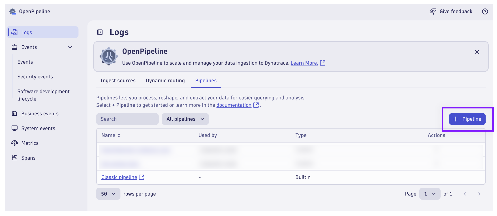
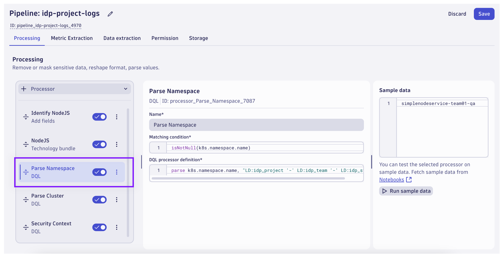
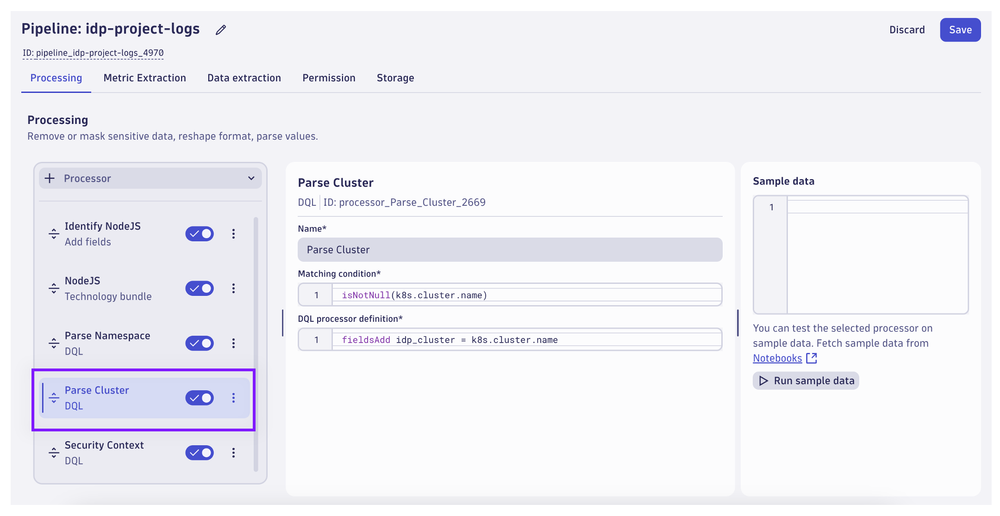
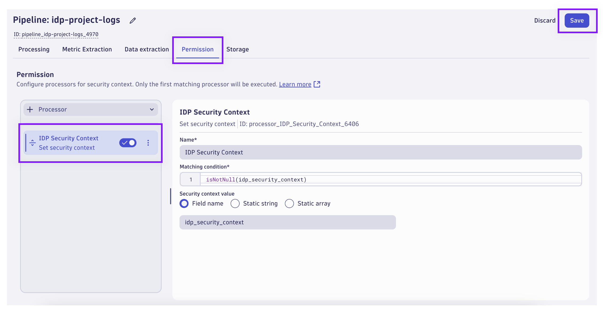
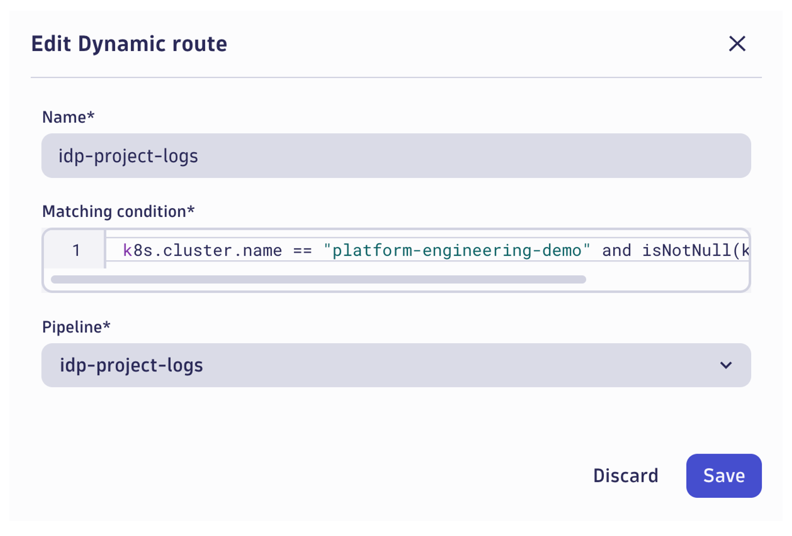
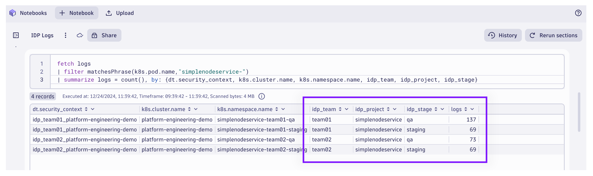

## OpenPipeline: Logs Pipeline

Use OpenPipeline to transform log data on ingest prior to being stored in Grail.

### Query Existing Log Data

Use the `Logs` App to explore the existing log data for the IDP and the deployed applications.  Note that Dynatrace is deployed with `Application Monitoring` Dynakube and Kubernetes Observability.  Logs are collected using an OpenTelemetry Collector that ships the logs to Dynatrace.


From the Logs App, try to locate logs that are relevant to a specific application team (i.e. team01 or team02).

Import the [IDP OpenPipeline Notebook](todo/notebook) Notebook into the Dynatrace environment.


Execute the first DQL query, which retrieves the logs from the `SimpleNodeService` pods.  Take notice of the `dt.security_context`, `idp_project`, `idp_team`, and `idp_stage` attributes.  We want to use OpenPipeline to modify/add these fields to the log records.

DQL:
```sql
fetch logs
| filter matchesPhrase(k8s.pod.name,"simplenodeservice-")
| sort timestamp desc
| fields timestamp, dt.security_context, k8s.cluster.name, k8s.namespace.name, k8s.container.name, idp_team, idp_project, idp_stage
```

### Create Pipeline

From the Dynatrace environment, locate and launch the `OpenPipeline` App.  Select the `Logs` tab on the left.


Click on the `Pipelines` tab.



Click on `+ Pipeline` to create a new pipeline.


Rename the pipeline to `idp-project-logs`.  Select the `Processing` tab.  Add a new processor and choose `Add fields`.

Name:
```text
Identify NodeJS
```

Matching Condition:
```text
matchesPhrase(k8s.pod.name,"simplenodeservice-")
```

Field Name:
```text
process.technology
```

Field Value:
```text
nodejs
```


Add a new processor and choose `Technology Bundle`.  Choose the `NodeJS` bundle in the Applications category.

This technology bundle will attempt to parse logs for patterns commonly used by NodeJS frameworks.



Add a new processor and choose `DQL`.

Name:
```text
Parse Namespace
```

Matching Condition:
```text
isNotNull(k8s.namespace.name)
```

DQL:
```text
parse k8s.namespace.name, "LD:idp_project '-' LD:idp_team '-' LD:idp_stage"
```



Add a new processor and choose `DQL`.

Name:
```text
Parse Cluster
```

Matching Condition:
```text
isNotNull(k8s.cluster.name)
```

DQL:
```text
fieldsAdd idp_cluster = k8s.cluster.name
```


Add a new processor and choose `DQL`.

Name:
```text
Security Context
```

Matching Condition:
```text
isNotNull(idp_cluster) and isNotNull(idp_team)
```

DQL:
```text
fieldsAdd idp_security_context = concat("idp_",idp_team,"_",idp_cluster)
```



Select the `Permission` tab.  Add a new processor and choose `Set security context`.

Name:
```text
IDP Security Context
```

Matching Condition:
```text
isNotNull(idp_security_context)
```

Field Name
```text
idp_security_context
```

Click on `Save` to save the pipeline configuration.

### Create Dynamic Route

From the OpenPipeline Logs configuration page, click on `Dynamic Routing`.


Click on `+ Dynamic Route` to create a new route for the pipeline.



Set the dynamic route properties:

Name:
```text
idp-project-logs
```

Matching Condition:
```text
k8s.cluster.name == "platform-engineering-demo" and isNotNull(k8s.namespace.name)
```

Pipeline:
```text
idp-project-logs
```

Click `Save` to save the dynamic route configuration.  This change is not retroactive.  New logs matching the condition will be routed through the new pipeline.

### Query New Log Data

The change will likely take a few minutes to complete.  After some time, return to the `IDP OpenPipeline` Notebook.


Re-run the first query.  Continue to run the query until the `idp_*` fields no longer return `null`.  The new fields can be used to filter log data at query time.  Additionally, the new value of `dt.security_context` can be used to configure record-level permissions with IAM Policies.

DQL:
```sql
fetch logs
| filter matchesPhrase(k8s.pod.name,"simplenodeservice-")
| sort timestamp desc
| fields timestamp, dt.security_context, k8s.cluster.name, k8s.namespace.name, k8s.container.name, idp_team, idp_project, idp_stage
```



Execute the second query and summarize the new log data.  It is now easy to identify logs based on the `idp_team`, `idp_project`, and `idp_stage` details.

DQL:
```sql
fetch logs
| filter matchesPhrase(k8s.pod.name,"simplenodeservice-")
| summarize logs = count(), by: {dt.security_context, k8s.cluster.name, k8s.namespace.name, idp_team, idp_project, idp_stage}
```

