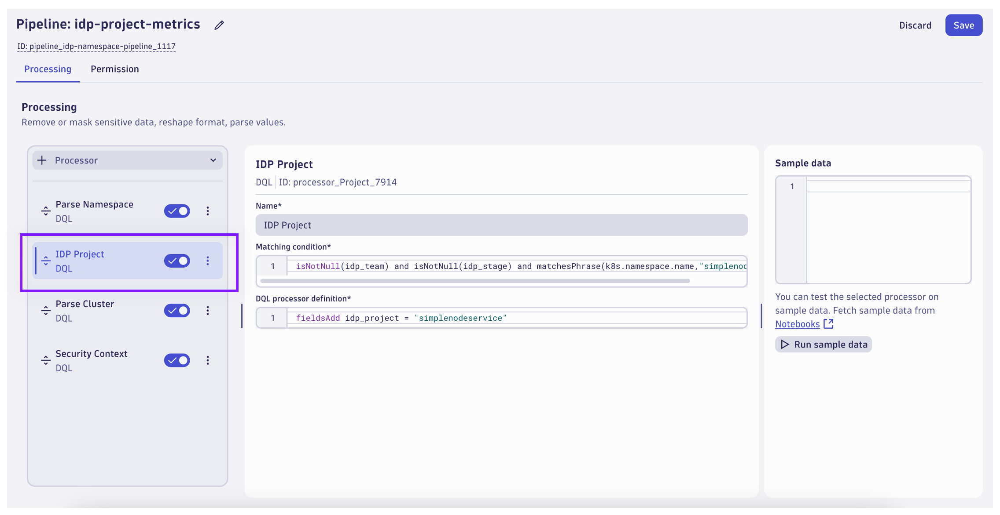

## OpenPipeline: Metrics Pipeline

Use OpenPipeline to transform metric data on ingest prior to being stored in Grail.

### Create Pipeline

From the Dynatrace environment, locate and launch the `OpenPipeline` App.  Select the `Metrics` tab on the left.


Click on the `Pipelines` tab.


Click on `+ Pipeline` to create a new pipeline.


Rename the pipeline to `idp-project-metrics`.  Select the `Processing` tab.  Add a new processor and choose `DQL`.

Name:
```text
Parse Namespace
```

Matching Condition:
```text
isNotNull(k8s.namespace.name) and matchesPhrase(k8s.namespace.name,"simplenodeservice")
```

DQL:
```text
parse k8s.namespace.name, "LD:idp_project '-' LD:idp_team '-' LD:idp_stage"
```



Add a new processor and choose `DQL`.

Name:
```text
IDP Project
```

Matching Condition:
```text
isNotNull(idp_team) and isNotNull(idp_stage) and matchesPhrase(k8s.namespace.name,"simplenodeservice")
```

DQL:
```text
fieldsAdd idp_project = "simplenodeservice"
```


Add a new processor and choose `DQL`.

Name:
```text
Parse Cluster
```

Matching Condition:
```text
isNotNull(k8s.cluster.name)
```

DQL:
```text
fieldsAdd idp_cluster = k8s.cluster.name
```


Add a new processor and choose `DQL`.

Name:
```text
Security Context
```

Matching Condition:
```text
isNotNull(idp_team) and isNotNull(idp_cluster)
```

DQL:
```text
fieldsAdd idp_security_context = concat("idp_",idp_team,"_",idp_cluster)
```


Select the `Permission` tab.  Add a new processor and choose `Set security context`.

Name:
```text
IDP Security Context
```

Matching Condition:
```text
isNotNull(idp_security_context)
```

Field Name
```text
idp_security_context
```

Click on `Save` to save the pipeline configuration.

### Create Dynamic Route

From the OpenPipeline Metrics configuration page, click on `Dynamic Routing`.


Click on `+ Dynamic Route` to create a new route for the pipeline.


Set the dynamic route properties:

Name:
```text
idp-project-metrics
```

Matching Condition:
```text
isNotNull(k8s.namespace.name) and matchesPhrase(k8s.namespace.name,"simplenodeservice")
```

Pipeline:
```text
idp-project-metrics
```

Click `Save` to save the dynamic route configuration.  This change is not retroactive.  New metric data points matching the condition will be routed through the new pipeline.

### Query New Metric Data

The change will likely take a few minutes to complete.  After some time, return to the `IDP OpenPipeline` Notebook.


Locate the first explore metrics section and query the metric `dt.kubernetes.container.cpu_usage`.

Leverage the new OpenPipeline configuration and filter the metric on `idp_project=simplenodeservice` and `idp_team=team01`.

Split the metric by `k8s.pod.name`.  The chart now shows container CPU usage per pod, only for pods that belong to idp team `team01`.


Locate the second explore metrics section and query the metric `dt.service.request.count`.

Leverage the new OpenPipeline configuration and filter the metric on `idp_team=team02`.

Split the metric by `idp_stage` and `dt.entity.service`.  The chart now shows service request count per service, only for services that belong to idp team `team02`.