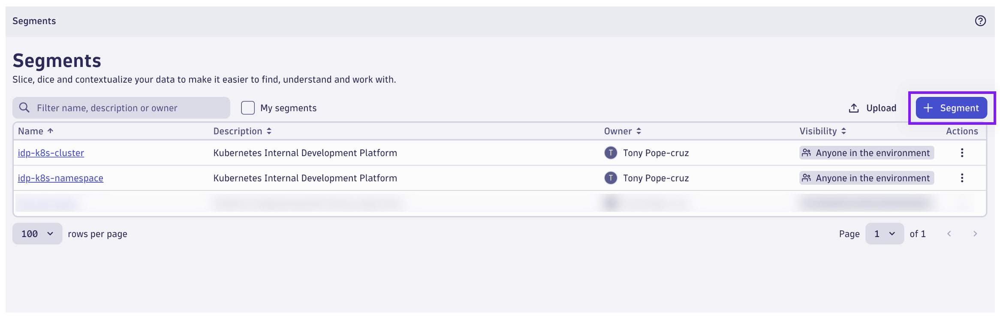

## Create IDP Project Team Segment

Create Segment to filter analysis on IDP Project Team

### Create Segment

In the Dynatrace environment, locate and launch the `Segments` App.



Click on `+ Segment` to create a new Segment.


Name the Segment `idp-proj-team`.

Begin by defining a Variable for the Segment.


In your Variables configuration, enter the following DQL Query:

```sql
fetch dt.entity.service
| fields id, entity.name, tags
| expand tags
| filter matchesPhrase(tags,"[Kubernetes]dt.owner")
| parse tags, "DATA:tag_key ':' DATA:tag_value"
| summarize count(), by: {tag_value, tags}
| fields `proj_team` = tag_value, tags
```

Click `Preview` to run the query.  You should see your `team01` and `team02` dt.owner details.

Click `Done`.


Under Segment data, create a new rule for `All data types`.  Type to add a filter.  Use the following filter:

```text
idp_team = "$proj_team"
```

Adding this segment data filter to our Segment will apply to any Grail data queries when this Segment is applied.

Under Segment data, create a new rule for `Entities` > `Service`.  Type to add a filter.  Use the following filter:

```text
tags = "$tags"
```

Add related entities to the Segment data filter.  Click on `+ Related entity` and choose `Process`.  This will include any Process entity that is related to the Service.  Type to add a filter.  Use the following filter:

```text
tags = "$tags"
```

Next, click on `+ Related entity` and choose `Process Group`.  Type to add a filter.  Use the following filter:

```text
tags = "$tags"
```

Repeat this process for ALL remaining related entity types, not using a filter.

As you make your configurations, clicking on `Preview` will allow you to see which entities or data types matched your filter.

When your Segment configuration is complete, click on `Save`.

Note: You can change the visibility of your Segment, however if you are the only one accessing the environment, this is irrelevant.