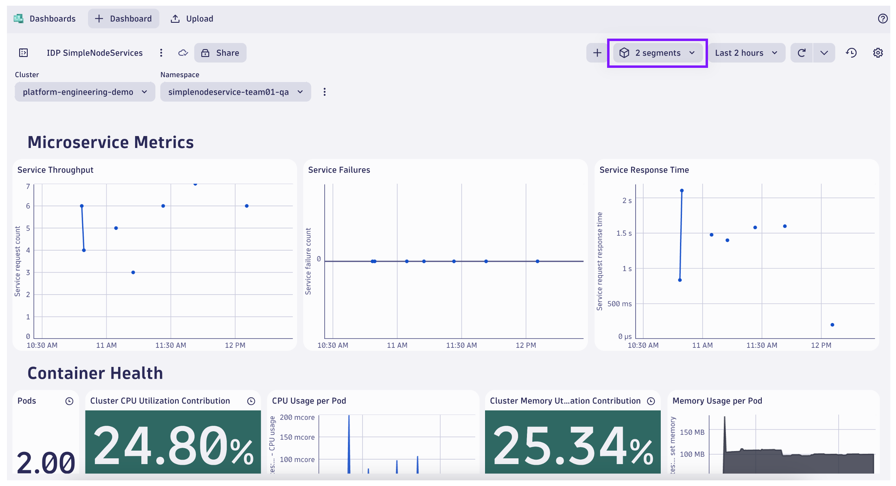
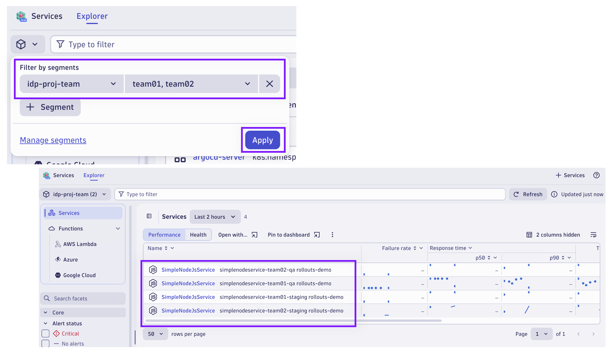

## Analyze with Segments

Analyze the applications in Dynatrace, this time using the newly created Segments.

### Explore IDP SimpleNodeServices Dashboard

If you haven't already, import the [IDP SimpleNodeServices](todo/dashboard) Dashboard into the Dynatrace environment.

If the previous Segment filters were removed, re-apply the cluster and namespace Segment filters.

Apply the new Segment filter to the dashboard.  Click on the `Segments` icon to open the Segments filter prompt (next to the timeframe selector).

Click on `+ Segment` to add a new Segment filter.  Select the `idp-proj-team` Segment.  Click the checkbox to apply `team01` for the dynamic Segment.

Click `Apply` to update the Segment filter.

Use the variable selector for `Namespace`.  Notice the reduced list of namespaces available to choose from.

### Explore Services App

Launch the `Services` App.  Identify the services that have been detected in the environment.

Locate and click on the `Segments` icon to open the Segments filter prompt (top left corner of the App).

Click on `+ Segment` to add a new Segment filter.  Select the `idp-proj-team` Segment.  Click the checkbox to apply `team01` and `team02` for the dynamic Segment.

Click `Apply` to update the Segment filter.

Notice the reduced list of services available to choose from.