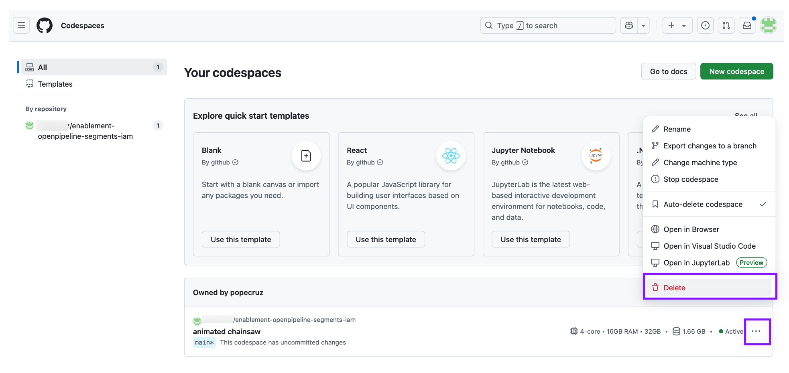

## Codespaces Cleanup

Delete your codespaces instance when you are finished.

Navigate to the GitHub Codespaces page at [https://github.com/codespaces/](https://github.com/codespaces/)

Locate your instance, click the `...` button, and click `Delete`.

When you're finished with the repository, you can delete your fork as well.